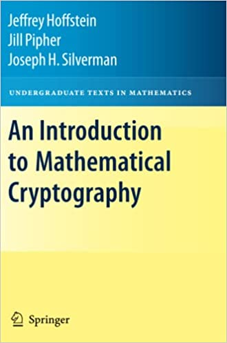

# An Introduction to Mathematical Cryptography

## Description:
An Introduction to Mathematical Cryptography provides an introduction to public key cryptography and underlying mathematics that is required for the subject. Each of the eight chapters expands on a specific area of mathematical cryptography and provides an extensive list of exercises.

It is a suitable text for advanced students in pure and applied mathematics and computer science, or the book may be used as a self-study. This book also provides a self-contained treatment of mathematical cryptography for the reader with limited mathematical background.

## Solutions:
| Chapter | Documents |
| ------- | --------- |
| 1 | <kbd>LaTeX</kbd> <kbd>PDF</kbd> |
| 2 | <kbd>LaTeX</kbd> <kbd>PDF</kbd> |
| 3 | <kbd>LaTeX</kbd> <kbd>PDF</kbd> |
| 4 | <kbd>LaTeX</kbd> <kbd>PDF</kbd> |
| 5 | <kbd>LaTeX</kbd> <kbd>PDF</kbd> |
| 6 | <kbd>LaTeX</kbd> <kbd>PDF</kbd> |
| 7 | <kbd>LaTeX</kbd> <kbd>PDF</kbd> |
| 8 | <kbd>LaTeX</kbd> <kbd>PDF</kbd> |
